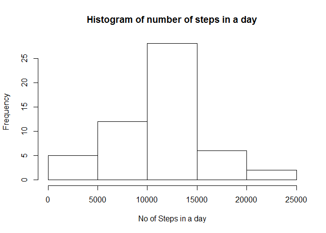

Reproducible Research - Activity Data Analysis
----------------------------------------------

This assignment makes use of data from a personal activity monitoring
device. This device collects data at 5 minute intervals through out the
day. The data consists of two months of data from an anonymous
individual collected during the months of October and November, 2012 and
include the number of steps taken in 5 minute intervals each day.

Reading Data
------------

    activityData <- read.csv('activity.csv')

Aggergate By Day
================

    aggregateByDay <- aggregate(steps ~ date, activityData, sum)

Histogram of the total number of steps taken each day
-----------------------------------------------------

    hist(aggregateByDay$steps , xlab="No of Steps in a day", main="Histogram of number of steps in a day")

Mean of steps taken each day
----------------------------

    mean(aggregateByDay$steps)

    ## [1] 10766.19

Median number of steps taken each day
-------------------------------------

    median(aggregateByDay$steps)

    ## [1] 10765

Aggregate By Interval
---------------------

    averagedByInterval <- aggregate(steps ~ interval, activityData, mean)

Time series plot of the average number of steps taken
=====================================================

    plot(averagedByInterval$interval, averagedByInterval$steps ,  xlab="Interval",
         ylab="Steps" ,main="Average number of steps taken", type="l")

The 5-minute interval that, on average, contains the maximum number of steps
============================================================================

    averagedByInterval[which(averagedByInterval$steps==max(averagedByInterval$steps)),]$interval

    ## [1] 835

No of rows with Missing Value
=============================

    nrow(activityData[(is.na(activityData$steps) |  is.na(activityData$date) |  is.na(activityData$interval)),])

    ## [1] 2304

Filling missing value using mean of interval
============================================

    activityData_filled <- activityData
    activityData_na <- is.na(activityData_filled$steps)
    int_avg <- tapply(activityData_filled$steps, activityData_filled$interval, mean, na.rm=TRUE, simplify=T)
    activityData_filled$steps[activityData_na] <- int_avg[as.character(activityData_filled$interval[activityData_na])]

total number of steps taken each day after missing values are imputed
---------------------------------------------------------------------

    aggregateByDay_filled <- aggregate(steps ~ date, activityData_filled, sum)

Histogram of the total number of steps taken each day after missing values are imputed
--------------------------------------------------------------------------------------

    hist(aggregateByDay_filled$steps , xlab="No of Steps in a day", main="Histogram of number of steps in a day")

Mean
----

    mean(aggregateByDay_filled$steps)

    ## [1] 10766.19

Median
------

    median(aggregateByDay_filled$steps)

    ## [1] 10766.19

Creating new factor for dow(Day of Week)
----------------------------------------

    weekdays <- c("Monday", "Tuesday", "Wednesday", "Thursday", 
                  "Friday")
    activityData_filled$dow = as.factor(ifelse(is.element(weekdays(as.Date(activityData_filled$date)),weekdays), "Weekday", "Weekend"))

Aggregate by DOW
----------------

    aggregateByDow <- aggregate(steps ~ interval + dow, activityData_filled, mean)

Panel plot comparing the average number of steps taken per 5-minute interval across weekdays and weekends
---------------------------------------------------------------------------------------------------------

    library(lattice)
    xyplot(aggregateByDow$steps ~ aggregateByDow$interval|aggregateByDow$dow, main="Average Steps across Weekends/Weekdays",xlab="Interval", ylab="Avg no of Steps",layout=c(1,2), type="l")

